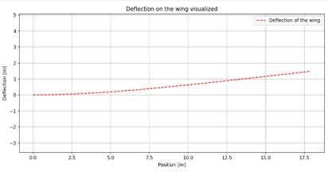
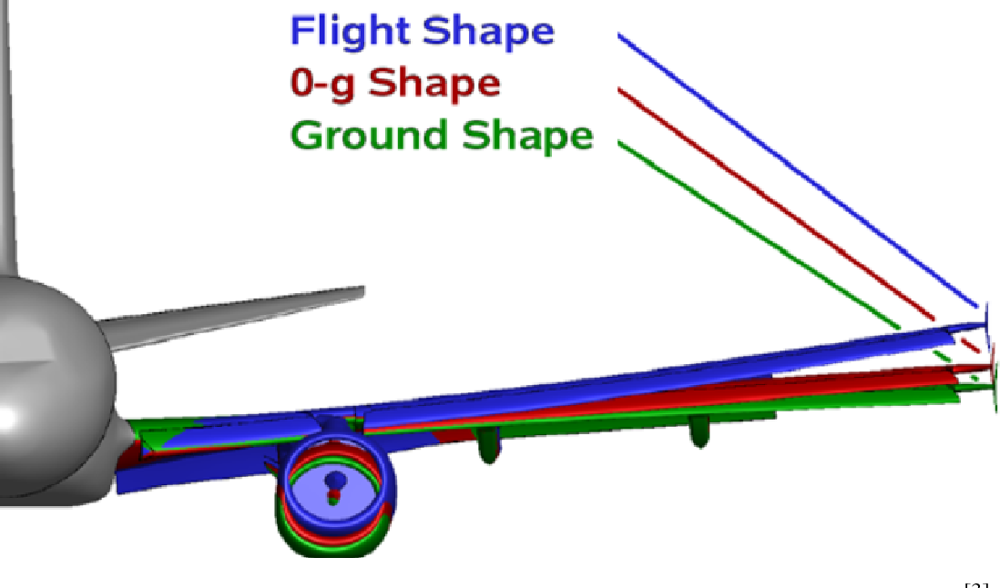

# EGR 115 Project: On a Wing and a Prayer
This project is a Python program that calculates how much an aircraft wing bends during flight. The user selects one of six aircraft types and chooses a material for the wing, such as carbon fiber, aluminum, titanium, or wood. The program then asks for the flight speed and altitude, which are used to calculate air density and the amount of lift produced by the wing. Using basic aerodynamics and beam deflection equations, the wing is modeled as a cantilever beam to estimate how much it bends under the load of the lift force. It calculates the total wing deflection and also shows how the deflection changes along the length of the wing. Finally, it creates a graph using Matplotlib to visualize how the wing bends from the root to the tip. This project demonstrates basic concepts from aerodynamics, structural mechanics, and scientific computing in Python.

Below is a picture of the output once the code has been ran through.
#
#
#

#
#
#
#
Example of how it would look in real life.

